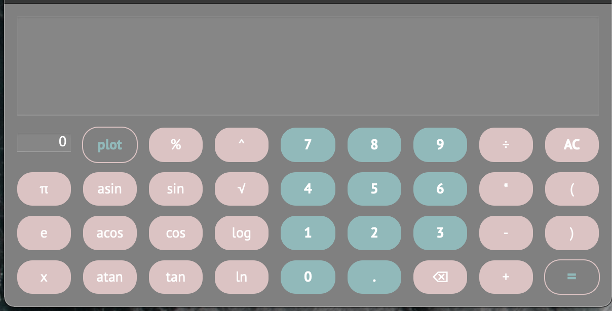
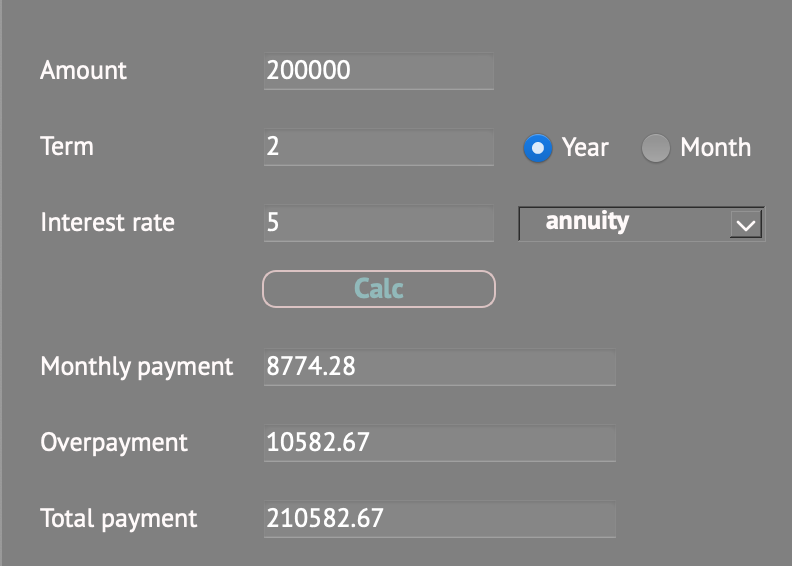
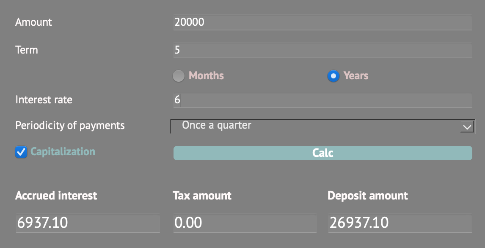

# Calculator
 Calculating arbitrary bracketed arithmetic expressions in infix notation. Plotting a graph of a function given by an expression in infix notation with the variable x.
Documentation SMARTCALC\_V2.0

DOCUMENTATION SMARTCALC\_V2.0
=============================

**SMARTCALC\_V2.0** - is implementation of extended version of the usual calculator. Calculating arbitrary bracketed arithmetic expressions in infix notation. Plotting a graph of a function given by an expression in infix notation with the variable x.

### Part 1. Implementation of SmartCalc v2.0

#### Arithmetic operators:

*   **Brackets** (a + b)
*   **Addition** a + b
*   **Subtraction** a - b
*   **Multiplication** a \* b
*   **Division** a / b
*   **Power** a ^ b
*   **Modulus** a % b
*   **Unary plus** +a
*   **Unary minus** -a

#### Function:

*   **cos(x)** computes cosine
*   **sin(x)** computes sine
*   **tan(x)** computes tangent
*   **acos(x)** computes arc cosine
*   **asin(x)** computes arc sine
*   **atan(x)** computes arc tangent
*   **sqrt(x)** computes square root
*   **ln(x)** computes natural logarithm
*   **log(x)** computes common logarithm

#### HOW TO USE:

1.  All buttons on the screen are active
2.  To calculate the expression, you need to click on the button **"="**
3.  To drawe plot, you need to click on the button **"PLOT"**
4.  To calculate equation, you need to enter x and click on the button **"="**

#### RECOMENDATION:

1.  Don't enter invalid values.
2.  Don't plot on a huge scale

### Part 2. Bonus. Credit calculator

Provide a special mode "credit calculator"

#### Function:

*   **monthly payment**
*   **overpayment on credit**
*   **total payment**

#### HOW TO USE:

1.  All buttons on the screen are active
2.  To calculate result you need to enter **total credit amount, term, interest rate, type (annuity, differentiated)**

#### RECOMENDATION:

1.  Don't enter invalid and huge o tiny values.

### Part 3. Bonus. Deposit calculator

Provide a special mode "deposit profitability calculator"

#### Function:

*   **accrued interest**
*   **tax amount**
*   **deposit amount by the end of the term**

#### HOW TO USE:

1.  All buttons on the screen are active
2.  To calculate result you need to enter **deposit amount, deposit term, interest rate, tax rate, periodicity of payments, capitalization of interest**

#### RECOMENDATION:

1.  Don't enter invalid and huge o tiny values.
